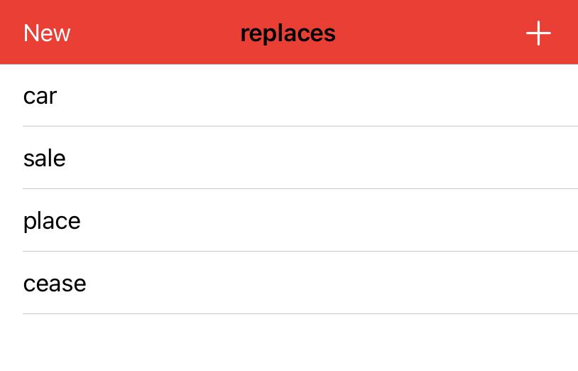
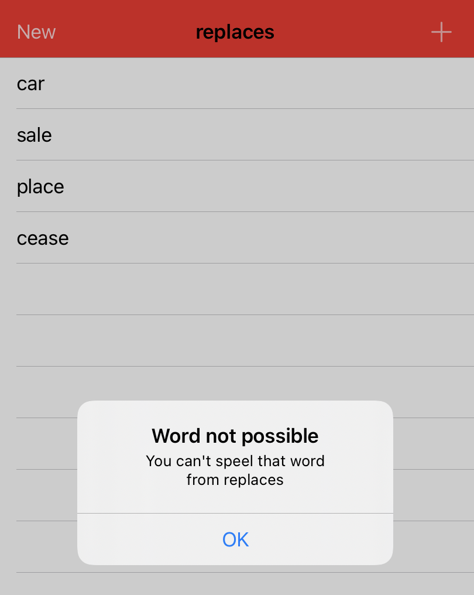

# Word-Scramble

## Description

This is a game where user is asked to create as much anagrams from a given word as possible. The application checks whether the entered word is real
(exists in the dictionary), original (it did not appear before) and can be combined using the given letters in the main word.

